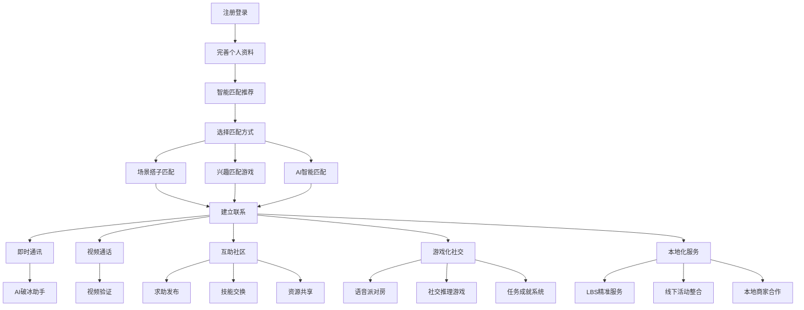

## 1. 产品概述
你好陌生人APP是一款基于AI技术的智能社交平台，旨在通过场景搭子匹配和AI赋能，帮助用户快速找到志同道合的伙伴，建立真实、有价值的社交关系。
- 解决传统社交APP匹配效率低、社交压力大、真实性不足等问题，为用户提供精准、有趣、安全的社交体验。
- 目标用户为18-35岁的年轻群体，覆盖学习、生活、兴趣等多个社交场景，市场潜力巨大。

## 2. 核心功能

### 2.1 用户角色
| 角色 | 注册方式 | 核心权限 |
|------|---------------------|------------------|
| 普通用户 | 手机号+身份证验证 | 使用基础社交功能，参与匹配和互助 |
| 认证用户 | 人脸识别+技能认证 | 解锁更多高级功能，参与技能交换 |
| 社区管理员 | 选举产生 | 管理社区内容，调解纠纷 |

### 2.2 功能模块
1. **首页**：智能匹配推荐、场景搭子入口、活动推荐
2. **匹配中心**：场景搭子匹配、AI智能匹配、兴趣匹配游戏
3. **聊天页面**：即时通讯、AI破冰助手、视频通话
4. **个人中心**：用户资料、信用评分、社交报告
5. **互助社区**：求助发布、技能交换、资源共享
6. **游戏化社交**：语音派对房、社交推理游戏、任务成就系统
7. **本地化服务**：LBS精准服务、线下活动整合、本地商家合作

### 2.3 页面详情
| 页面名称 | 模块名称 | 功能描述 |
|-----------|-------------|---------------------|
| 首页 | 智能匹配推荐 | 根据用户兴趣、地理位置等多维度推荐匹配对象 |
| 首页 | 场景搭子入口 | 提供学习、生活、兴趣等场景搭子快速入口 |
| 首页 | 活动推荐 | 推荐附近的线下活动和线上兴趣小组 |
| 匹配中心 | 场景搭子匹配 | 细分学习、生活、兴趣等场景进行精准匹配 |
| 匹配中心 | AI智能匹配 | 基于行为数据、情绪状态等多维度智能匹配 |
| 匹配中心 | 兴趣匹配游戏 | 通过游戏化方式发现兴趣相投的用户 |
| 聊天页面 | 即时通讯 | 支持文字、语音、图片、视频等多种消息形式 |
| 聊天页面 | AI破冰助手 | 提供智能开场白、话题推荐、沟通质量分析 |
| 聊天页面 | 视频通话 | 支持实时视频通话，增强真实性 |
| 个人中心 | 用户资料 | 个人信息管理、视频名片、技能认证 |
| 个人中心 | 信用评分 | 多维度信用评价展示，影响匹配优先级 |
| 个人中心 | 社交报告 | 社交行为分析、成长轨迹、个性化建议 |
| 互助社区 | 求助发布 | 发布紧急求助、日常帮助、技能求助等 |
| 互助社区 | 技能交换 | 技能认证、标准化定价、担保交易 |
| 互助社区 | 资源共享 | 物品共享、空间共享、时间银行 |
| 游戏化社交 | 语音派对房 | 主题房间、3D语音空间、互动道具 |
| 游戏化社交 | 社交推理游戏 | 海龟汤、剧本杀、狼人杀等轻量级游戏 |
| 游戏化社交 | 任务成就系统 | 每日任务、每周挑战、成就徽章 |
| 本地化服务 | LBS精准服务 | 500米生活圈、社区资源共享、本地信息墙 |
| 本地化服务 | 线下活动整合 | 活动发现引擎、活动创建工具、活动安全系统 |
| 本地化服务 | 本地商家合作 | 合作场地、专属优惠、联合活动 |

## 3. 核心流程
用户注册登录后，首先完善个人资料和兴趣标签，系统根据用户信息进行智能匹配推荐。用户可以选择场景搭子匹配、兴趣匹配游戏等多种方式寻找伙伴，通过AI破冰助手辅助沟通，建立联系后可以进行即时通讯和视频通话。同时，用户可以参与互助社区、游戏化社交和本地化服务，丰富社交体验。

## 4. 用户界面设计
### 4.1 设计风格
- 主色调：渐变蓝紫色 (#6B46C1 到 #4F46E5)，象征科技与创新
- 辅助色：活力橙 (#F97316)，用于强调和互动元素
- 中性色：深灰 (#1F2937)、中灰 (#6B7280)、浅灰 (#F3F4F6)
- 按钮风格：圆角设计，带有微妙的阴影和 hover 效果
- 字体：主标题使用 Inter Bold，正文使用 Inter Regular
- 字体大小：标题 24px，副标题 18px，正文 14px，小字 12px
- 布局风格：卡片式布局，顶部导航栏，底部标签栏（移动端）
- 图标风格：线性图标，简洁现代，搭配适当的动效

### 4.2 页面设计概览
| 页面名称 | 模块名称 | UI元素 |
|-----------|-------------|-------------|
| 首页 | 智能匹配推荐 | 卡片式推荐列表，带有用户头像、标签和匹配度，支持滑动操作 |
| 首页 | 场景搭子入口 | 网格布局的场景图标，带有动态效果，点击进入对应场景 |
| 首页 | 活动推荐 | 横向滚动的活动卡片，展示活动时间、地点和参与人数 |
| 匹配中心 | 场景搭子匹配 | 分类标签页，每个场景下有详细的匹配选项和筛选条件 |
| 匹配中心 | AI智能匹配 | 可视化匹配算法展示，用户可以调整匹配偏好 |
| 匹配中心 | 兴趣匹配游戏 | 游戏化界面，带有动画效果和互动元素 |
| 聊天页面 | 即时通讯 | 气泡式消息布局，支持消息状态显示和快速回复 |
| 聊天页面 | AI破冰助手 | 悬浮式助手按钮，点击展开建议列表 |
| 聊天页面 | 视频通话 | 全屏视频界面，带有虚拟背景和滤镜选项 |
| 个人中心 | 用户资料 | 个人信息展示，带有视频名片播放器和技能标签 |
| 个人中心 | 信用评分 | 可视化信用分仪表盘，展示各维度信用数据 |
| 个人中心 | 社交报告 | 图表式数据展示，带有趋势分析和建议卡片 |
| 互助社区 | 求助发布 | 表单式发布界面，支持图文和地理位置信息 |
| 互助社区 | 技能交换 | 技能卡片展示，带有价格和评价信息 |
| 互助社区 | 资源共享 | 资源分类浏览，支持搜索和筛选 |
| 游戏化社交 | 语音派对房 | 虚拟房间界面，带有3D空间感和互动道具 |
| 游戏化社交 | 社交推理游戏 | 游戏界面，带有角色卡片和聊天区域 |
| 游戏化社交 | 任务成就系统 | 任务列表和成就徽章展示，带有进度条 |
| 本地化服务 | LBS精准服务 | 地图界面，展示附近用户和资源点 |
| 本地化服务 | 线下活动整合 | 日历式活动展示，支持报名和分享 |
| 本地化服务 | 本地商家合作 | 商家卡片展示，带有优惠信息和距离 |

### 4.3 响应式设计
- 桌面端：多栏布局，充分利用宽屏空间，导航栏固定在左侧
- 平板端：双栏布局，导航栏可折叠，内容区域自适应
- 移动端：单栏布局，底部标签栏导航，手势操作优化
- 触控优化：按钮和可点击元素尺寸不小于44px，支持滑动、捏合等手势

### 4.4 3D场景指导（可选）
- 环境/HDRI：使用柔和的室内环境光，营造温馨的社交氛围
- 光照设置：主光源来自上方，辅助光源从侧面补充，避免 harsh 阴影
- 相机设置：轻微俯视角度，距离适中，确保人物面部清晰可见
- 构图：人物居中，背景简洁，突出主体
- 交互：支持头部追踪和表情捕捉，增强真实感
- 后处理：轻微的景深效果，提升画面层次感
- 资产来源：使用低多边形风格的3D模型，确保性能流畅
- 性能预算：3D场景渲染帧率不低于30fps，内存占用不超过200MB