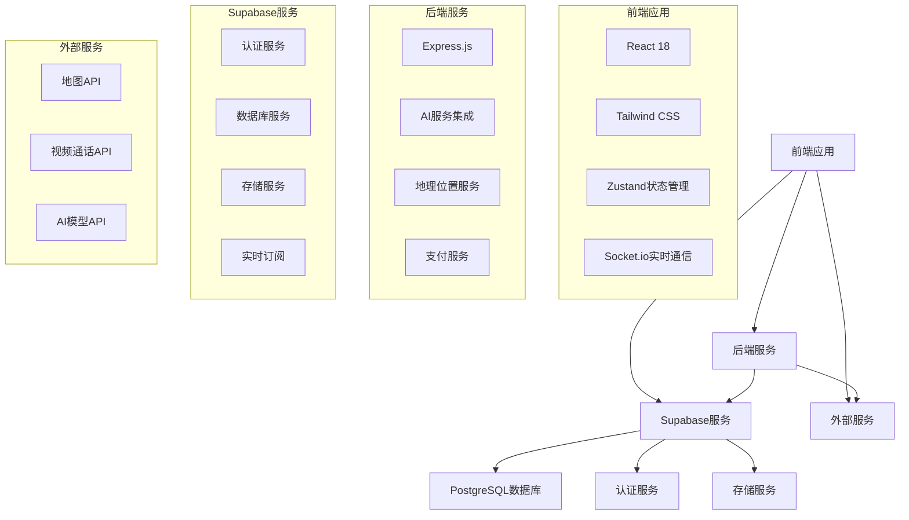
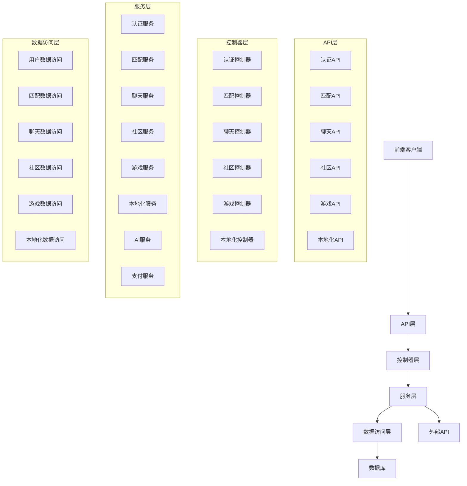
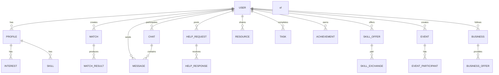

## 1. 架构设计


## 2. 技术描述
- 前端：React@18 + Tailwind CSS@3 + Vite + Zustand + Socket.io
- 初始化工具：vite-init
- 后端：Express@4 + Node.js
- 数据库：Supabase (PostgreSQL)
- 认证：Supabase Auth
- 存储：Supabase Storage
- 实时通信：Socket.io
- 地理位置：高德地图API
- 视频通话：WebRTC
- AI服务：OpenAI API

## 3. 路由定义
| 路由 | 用途 |
|-------|---------|
| / | 首页 |
| /match | 匹配中心 |
| /chat | 聊天页面 |
| /profile | 个人中心 |
| /community | 互助社区 |
| /game | 游戏化社交 |
| /local | 本地化服务 |
| /login | 登录页面 |
| /register | 注册页面 |
| /settings | 设置页面 |

## 4. API定义
### 4.1 前端API
#### 认证API
- `POST /api/auth/register` - 用户注册
- `POST /api/auth/login` - 用户登录
- `POST /api/auth/logout` - 用户登出
- `GET /api/auth/user` - 获取当前用户信息

#### 匹配API
- `GET /api/match/recommend` - 获取推荐匹配
- `POST /api/match/scene` - 场景搭子匹配
- `POST /api/match/interest` - 兴趣匹配
- `GET /api/match/history` - 获取匹配历史

#### 聊天API
- `GET /api/chat/list` - 获取聊天列表
- `GET /api/chat/messages` - 获取聊天消息
- `POST /api/chat/send` - 发送消息
- `POST /api/chat/video` - 发起视频通话

#### 社区API
- `GET /api/community/help` - 获取求助列表
- `POST /api/community/help` - 发布求助
- `GET /api/community/skill` - 获取技能列表
- `POST /api/community/skill` - 发布技能
- `GET /api/community/resource` - 获取资源列表
- `POST /api/community/resource` - 发布资源

#### 游戏API
- `GET /api/game/room` - 获取语音房间列表
- `POST /api/game/room` - 创建语音房间
- `GET /api/game/task` - 获取任务列表
- `POST /api/game/task` - 完成任务

#### 本地化API
- `GET /api/local/nearby` - 获取附近用户
- `GET /api/local/event` - 获取附近活动
- `POST /api/local/event` - 创建活动
- `GET /api/local/business` - 获取附近商家

### 4.2 后端API
#### AI服务
- `POST /api/ai/icebreaker` - 生成破冰开场白
- `POST /api/ai/topic` - 推荐聊天话题
- `POST /api/ai/analysis` - 分析沟通质量
- `POST /api/ai/match` - 智能匹配算法

#### 支付服务
- `POST /api/payment/create` - 创建支付订单
- `POST /api/payment/callback` - 支付回调
- `GET /api/payment/history` - 获取支付历史

#### 数据服务
- `GET /api/data/user` - 获取用户数据
- `POST /api/data/user` - 更新用户数据
- `GET /api/data/report` - 获取社交报告
- `POST /api/data/feedback` - 提交反馈

## 5. 服务器架构图


## 6. 数据模型
### 6.1 数据模型定义


### 6.2 数据定义语言
#### 用户表
```sql
CREATE TABLE users (
    id UUID PRIMARY KEY DEFAULT gen_random_uuid(),
    phone VARCHAR(20) UNIQUE NOT NULL,
    email VARCHAR(255) UNIQUE,
    password_hash VARCHAR(255) NOT NULL,
    role VARCHAR(20) DEFAULT 'user',
    created_at TIMESTAMP DEFAULT NOW(),
    updated_at TIMESTAMP DEFAULT NOW()
);

CREATE TABLE profiles (
    id UUID PRIMARY KEY REFERENCES users(id),
    nickname VARCHAR(50) NOT NULL,
    avatar VARCHAR(255),
    video_card VARCHAR(255),
    bio TEXT,
    gender VARCHAR(10),
    age INTEGER,
    location VARCHAR(100),
    latitude DOUBLE PRECISION,
    longitude DOUBLE PRECISION,
   信用_score INTEGER DEFAULT 800,
    created_at TIMESTAMP DEFAULT NOW(),
    updated_at TIMESTAMP DEFAULT NOW()
);

CREATE TABLE interests (
    id SERIAL PRIMARY KEY,
    user_id UUID REFERENCES users(id),
    interest VARCHAR(50) NOT NULL,
    created_at TIMESTAMP DEFAULT NOW()
);

CREATE TABLE skills (
    id SERIAL PRIMARY KEY,
    user_id UUID REFERENCES users(id),
    skill VARCHAR(50) NOT NULL,
    level VARCHAR(20),
    description TEXT,
    created_at TIMESTAMP DEFAULT NOW()
);
```

#### 匹配表
```sql
CREATE TABLE matches (
    id SERIAL PRIMARY KEY,
    user_id UUID REFERENCES users(id),
    target_user_id UUID REFERENCES users(id),
    match_type VARCHAR(50) NOT NULL,
    match_score INTEGER,
    status VARCHAR(20) DEFAULT 'pending',
    created_at TIMESTAMP DEFAULT NOW(),
    updated_at TIMESTAMP DEFAULT NOW()
);

CREATE TABLE match_results (
    id SERIAL PRIMARY KEY,
    match_id INTEGER REFERENCES matches(id),
    result VARCHAR(20) NOT NULL,
    feedback TEXT,
    created_at TIMESTAMP DEFAULT NOW()
);
```

#### 聊天表
```sql
CREATE TABLE chats (
    id SERIAL PRIMARY KEY,
    user1_id UUID REFERENCES users(id),
    user2_id UUID REFERENCES users(id),
    status VARCHAR(20) DEFAULT 'active',
    last_message TEXT,
    last_message_at TIMESTAMP,
    created_at TIMESTAMP DEFAULT NOW(),
    updated_at TIMESTAMP DEFAULT NOW()
);

CREATE TABLE messages (
    id SERIAL PRIMARY KEY,
    chat_id INTEGER REFERENCES chats(id),
    sender_id UUID REFERENCES users(id),
    content TEXT NOT NULL,
    message_type VARCHAR(20) DEFAULT 'text',
    status VARCHAR(20) DEFAULT 'sent',
    created_at TIMESTAMP DEFAULT NOW()
);
```

#### 社区表
```sql
CREATE TABLE help_requests (
    id SERIAL PRIMARY KEY,
    user_id UUID REFERENCES users(id),
    title VARCHAR(100) NOT NULL,
    description TEXT NOT NULL,
    category VARCHAR(50) NOT NULL,
    location VARCHAR(100),
    latitude DOUBLE PRECISION,
    longitude DOUBLE PRECISION,
    status VARCHAR(20) DEFAULT 'open',
    created_at TIMESTAMP DEFAULT NOW(),
    updated_at TIMESTAMP DEFAULT NOW()
);

CREATE TABLE help_responses (
    id SERIAL PRIMARY KEY,
    help_request_id INTEGER REFERENCES help_requests(id),
    user_id UUID REFERENCES users(id),
    response TEXT NOT NULL,
    status VARCHAR(20) DEFAULT 'pending',
    created_at TIMESTAMP DEFAULT NOW(),
    updated_at TIMESTAMP DEFAULT NOW()
);

CREATE TABLE skill_offers (
    id SERIAL PRIMARY KEY,
    user_id UUID REFERENCES users(id),
    skill VARCHAR(50) NOT NULL,
    description TEXT NOT NULL,
    price DECIMAL(10,2),
    status VARCHAR(20) DEFAULT 'active',
    created_at TIMESTAMP DEFAULT NOW(),
    updated_at TIMESTAMP DEFAULT NOW()
);

CREATE TABLE resources (
    id SERIAL PRIMARY KEY,
    user_id UUID REFERENCES users(id),
    title VARCHAR(100) NOT NULL,
    description TEXT NOT NULL,
    resource_type VARCHAR(50) NOT NULL,
    location VARCHAR(100),
    latitude DOUBLE PRECISION,
    longitude DOUBLE PRECISION,
    status VARCHAR(20) DEFAULT 'available',
    created_at TIMESTAMP DEFAULT NOW(),
    updated_at TIMESTAMP DEFAULT NOW()
);
```

#### 游戏表
```sql
CREATE TABLE game_rooms (
    id SERIAL PRIMARY KEY,
    creator_id UUID REFERENCES users(id),
    room_name VARCHAR(100) NOT NULL,
    room_type VARCHAR(50) NOT NULL,
    max_players INTEGER,
    current_players INTEGER DEFAULT 0,
    status VARCHAR(20) DEFAULT 'active',
    created_at TIMESTAMP DEFAULT NOW(),
    updated_at TIMESTAMP DEFAULT NOW()
);

CREATE TABLE room_participants (
    id SERIAL PRIMARY KEY,
    room_id INTEGER REFERENCES game_rooms(id),
    user_id UUID REFERENCES users(id),
    joined_at TIMESTAMP DEFAULT NOW()
);

CREATE TABLE tasks (
    id SERIAL PRIMARY KEY,
    task_name VARCHAR(100) NOT NULL,
    task_type VARCHAR(50) NOT NULL,
    difficulty VARCHAR(20),
    reward INTEGER,
    status VARCHAR(20) DEFAULT 'active',
    created_at TIMESTAMP DEFAULT NOW(),
    updated_at TIMESTAMP DEFAULT NOW()
);

CREATE TABLE user_tasks (
    id SERIAL PRIMARY KEY,
    user_id UUID REFERENCES users(id),
    task_id INTEGER REFERENCES tasks(id),
    status VARCHAR(20) DEFAULT 'pending',
    completed_at TIMESTAMP,
    created_at TIMESTAMP DEFAULT NOW()
);

CREATE TABLE achievements (
    id SERIAL PRIMARY KEY,
    achievement_name VARCHAR(100) NOT NULL,
    description TEXT,
    icon VARCHAR(255),
    created_at TIMESTAMP DEFAULT NOW()
);

CREATE TABLE user_achievements (
    id SERIAL PRIMARY KEY,
    user_id UUID REFERENCES users(id),
    achievement_id INTEGER REFERENCES achievements(id),
    unlocked_at TIMESTAMP DEFAULT NOW()
);
```

#### 本地化表
```sql
CREATE TABLE events (
    id SERIAL PRIMARY KEY,
    creator_id UUID REFERENCES users(id),
    event_name VARCHAR(100) NOT NULL,
    description TEXT NOT NULL,
    event_type VARCHAR(50) NOT NULL,
    location VARCHAR(100) NOT NULL,
    latitude DOUBLE PRECISION,
    longitude DOUBLE PRECISION,
    start_time TIMESTAMP NOT NULL,
    end_time TIMESTAMP NOT NULL,
    max_participants INTEGER,
    current_participants INTEGER DEFAULT 0,
    status VARCHAR(20) DEFAULT 'active',
    created_at TIMESTAMP DEFAULT NOW(),
    updated_at TIMESTAMP DEFAULT NOW()
);

CREATE TABLE event_participants (
    id SERIAL PRIMARY KEY,
    event_id INTEGER REFERENCES events(id),
    user_id UUID REFERENCES users(id),
    status VARCHAR(20) DEFAULT 'registered',
    created_at TIMESTAMP DEFAULT NOW()
);

CREATE TABLE businesses (
    id SERIAL PRIMARY KEY,
    business_name VARCHAR(100) NOT NULL,
    description TEXT,
    address VARCHAR(200) NOT NULL,
    latitude DOUBLE PRECISION,
    longitude DOUBLE PRECISION,
    category VARCHAR(50) NOT NULL,
    rating DECIMAL(3,1),
    created_at TIMESTAMP DEFAULT NOW(),
    updated_at TIMESTAMP DEFAULT NOW()
);

CREATE TABLE business_offers (
    id SERIAL PRIMARY KEY,
    business_id INTEGER REFERENCES businesses(id),
    offer_name VARCHAR(100) NOT NULL,
    description TEXT,
    discount DECIMAL(5,2),
    valid_until TIMESTAMP,
    status VARCHAR(20) DEFAULT 'active',
    created_at TIMESTAMP DEFAULT NOW(),
    updated_at TIMESTAMP DEFAULT NOW()
);
```

#### 权限设置
```sql
-- 为 anon 角色授予基本读取权限
GRANT SELECT ON users, profiles, interests, skills, matches, match_results, chats, messages, help_requests, skill_offers, resources, game_rooms, tasks, achievements, events, businesses TO anon;

-- 为 authenticated 角色授予全部权限
GRANT ALL PRIVILEGES ON users, profiles, interests, skills, matches, match_results, chats, messages, help_requests, help_responses, skill_offers, resources, game_rooms, room_participants, tasks, user_tasks, achievements, user_achievements, events, event_participants, businesses, business_offers TO authenticated;
```